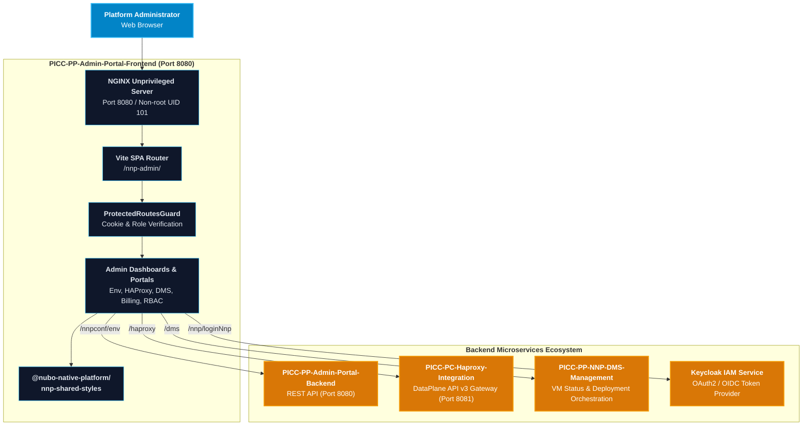

# PICC-PP-Admin-Portal-Frontend

[](https://react.dev/)
[](https://www.typescriptlang.org/)
[](https://vite.dev/)
[](https://tailwindcss.com/)
[](https://www.npmjs.com/package/@nubo-native-platform/nnp-shared-styles)
[](LICENSE)
[]()

Enterprise administration portal single-page application (SPA) providing centralized environment topology management, dynamic HAProxy DataPlane API v3 ingress orchestration, Document Management Service (DMS) deployment control, multi-tenant RBAC permissions, and resource billing governance across the **Platform Infrastructure and Core Components (PICC)** suite of the **Nubo Native Platform (NNP)**.

---

## Table of Contents

- [Overview](#overview)
- [Key Architectural Features](#key-architectural-features)
- [Architecture and Ecosystem](#architecture-and-ecosystem)
- [Technology Matrix](#technology-matrix)
- [Quick Start](#quick-start)
  - [Prerequisites](#prerequisites)
  - [Configuration](#configuration)
  - [Local Development Execution](#local-development-execution)
  - [Docker Container Execution](#docker-container-execution)
  - [Docker Compose Multi-Container Setup](#docker-compose-multi-container-setup)
- [Administrative Capabilities](#administrative-capabilities)
- [Environment Configuration Matrix](#environment-configuration-matrix)
- [Project Documentation](#project-documentation)
- [Repository Structure](#repository-structure)
- [Security and Vulnerability Management](#security-and-vulnerability-management)
- [Contributing](#contributing)
- [License](#license)

---

## Overview

**`PICC-PP-Admin-Portal-Frontend`** provides platform operators and system administrators with a unified, high-performance web interface to govern platform infrastructure services. It interfaces directly with backend microservices including **`PICC-PP-Admin-Portal-Backend`**, **`PICC-PC-Haproxy-Integration`**, **`PICC-PP-NNP-DMS-Management`**, Keycloak IAM, and Redmine issue tracking.

Designed with **React 19**, **TypeScript**, and **Vite**, the application utilizes **`@nubo-native-platform/nnp-shared-styles`** for platform-wide design token consistency, dark/light theme switching, and accessible enterprise UX standards.

---

## Key Architectural Features

- **Modern Single-Page Architecture**: React 19 functional architecture with strict TypeScript typing and Vite bundler for sub-second hot module replacement.
- **Unified Design System**: Integrates `@nubo-native-platform/nnp-shared-styles` for consistent typography, color palettes, spacing tokens, and dark mode theming.
- **Dynamic HAProxy Ingress Management**: Full administrative control over HAProxy DataPlane API v3 routing patterns (`K8S_DNS`, `EXTERNAL_IP`, `SSL`, `PATH_REWRITE`, `WEBSOCKET`, `TIME_CONFIGURABLE`, and `TCP`).
- **DMS Deployment & Live Terminal**: Multi-container VM status validation, automated microservice deployment triggering, and embedded interactive web terminal integration.
- **Hierarchical Environment Trees**: Deep inspection and mutation of platform environments, feature toggles, elements, and child configurations with real-time audit logging.
- **Zero-Trust Session Management**: Secure cookie-mediated authentication (`nnp-token`), client-side route guards (`ProtectedRoutesGuard`), and dynamic origin resolution.
- **Cloud-Native Containerization**: Multi-stage unprivileged NGINX Alpine runtime with OWASP security headers, gzip compression, and `/healthz` liveness probes.

---

## Architecture and Ecosystem



---

## Technology Matrix

| Category | Technology / Library | Version | Role / Description |
| :--- | :--- | :--- | :--- |
| **Framework** | React | `19.1.0` | Declarative user interface library |
| **Language** | TypeScript | `5.8.3` | Strongly-typed JavaScript superset |
| **Build Tool** | Vite | `7.1.2` | Next-generation frontend build tooling |
| **Styling & Tokens** | `@nubo-native-platform/nnp-shared-styles` | `^1.1.7` | Standardized platform design tokens & SCSS library |
| **CSS Framework** | Tailwind CSS | `4.1.11` | Utility-first responsive CSS styling |
| **Component UI** | Material UI (MUI) & X-DataGrid | `7.2.0` / `8.7.0` | High-performance enterprise tables and data grids |
| **Code Editor** | CodeMirror | `4.25.11` | In-browser YAML and configuration editor |
| **Icons** | Lucide React & React Icons | `0.525.0` / `5.5.0` | Modern, scalable SVG iconography |
| **Runtime Container** | `nginxinc/nginx-unprivileged` | `1.27-alpine` | Hardened, unprivileged containerized web server |

---

## Quick Start

### Prerequisites
- **Node.js**: `v20.x` or `v22.x` LTS
- **npm**: `v10.x` or higher
- **Docker** & **Docker Compose** (optional)

### Configuration
Copy the configuration template and customize required endpoints:
```bash
cp .env.example .env
```

### Local Development Execution
```bash
# Install dependencies
npm ci --legacy-peer-deps

# Start Vite development server
npm run dev
```
Navigate to `http://localhost:5173/nnp-admin/`.

### Docker Container Execution
```bash
# Build multi-stage production container
docker build -t picc-pp-admin-portal-frontend:latest .

# Run unprivileged container on port 8080
docker run -d --name admin-portal-frontend -p 8080:8080 picc-pp-admin-portal-frontend:latest
```

### Docker Compose Multi-Container Setup
```bash
docker compose up -d
```

---

## Administrative Capabilities

1. **Environment Topology & Features**:
   - Dynamic exploration of environments, features, elements, and child elements.
   - Comprehensive audit logging of configuration mutations per environment.
2. **HAProxy DataPlane Routing**:
   - Orchestrate backends, server pools, ACLs, and use_backend switching rules.
   - Live reconciliation of on-disk `/etc/haproxy/haproxy.cfg` file drifts.
3. **DMS Infrastructure Orchestration**:
   - VM pre-validation, container provisioning, and live remote web terminal access.
4. **Tenant RBAC & Access Management**:
   - Fine-grained role definition, user assignment, credential management, and status controls.
5. **Subscription Plans & Resource Quotas**:
   - Component quota enforcement, consumption analytics, and billing cycle reporting.

---

## Environment Configuration Matrix

| Variable | Description | Safe Default |
| :--- | :--- | :--- |
| `PORT` | Container HTTP listen port | `8080` |
| `VITE_BASE_URL` | Application base routing path | `/nnp-admin/` |
| `VITE_DOMAIN` | Base domain URL for platform services | `http://localhost:3000` |
| `VITE_AUTH` | Authentication service endpoint | `http://localhost:3000/nnp` |
| `VITE_AUTH_HOST` | Authentication gateway host | `http://localhost:3000/nnp` |
| `VITE_DASH` | User dashboard API endpoint | `http://localhost:3000/nnpdash` |
| `VITE_ADMIN_POTAL` | Admin configuration service root | `http://localhost:3000/nnpconf` |
| `VITE_NNP_CONFT_PUB`| Public metadata API endpoint | `http://localhost:3000/nnpconf-pub` |
| `VITE_API_ENVIRONMENT_MANAGEMENT_URL` | Environment management microservice API | `/nnpconf/env` |
| `VITE_API_USER_ACCESS_URL` | User access and RBAC microservice API | `/nnpconf/user` |
| `VITE_API_DMS_MANAGEMENT_URL` | Document Management Service API | `/dms-management-service/api/dms` |
| `VITE_API_CONFIG_URL` | HAProxy DataPlane microservice API | `http://localhost:8081` |
| `VITE_SUPPORT_URL` | Support ticketing API | `/nnpdash/support` |
| `VITE_REDMINE_URL` | Redmine issue tracking instance URL | `https://redmine.example.com` |
| `VITE_COOKIE_DOMAIN` | Scoped cookie domain | `.localhost` |

---

## Project Documentation

- 📘 [User Manual & Deployment Guide](USER_MANUAL_AND_DEPLOYMENT_GUIDE.md) — Comprehensive operations, Kubernetes manifests, and troubleshooting.
- 🛠️ [Development Guidelines](DEVELOPMENT_GUIDELINES.md) — Architectural standards, TypeScript conventions, and PR checklists.
- 🤝 [Contributing Guide](CONTRIBUTING.md) — How to propose features, open PRs, and participate.
- 🔐 [Security Policy](SECURITY.md) — Vulnerability disclosure process and secret prevention.
- 📜 [Code of Conduct](CODE_OF_CONDUCT.md) — Community standards and enforcement.
- 👥 [Maintainers](MAINTAINERS.md) — Core platform maintainers and contact information.

---

## Repository Structure

```
.
├── .github/workflows/ci-cd.yml             # GitHub Actions CI/CD pipeline
├── .env.example                            # Configuration environment template
├── .gitattributes                          # Git normalization rules
├── .gitignore                              # Secret and build artifact exclusions
├── Dockerfile                              # Multi-stage unprivileged NGINX container
├── docker-compose.yml                      # Local multi-container Docker compose spec
├── default.conf                            # Security-hardened NGINX server configuration
├── package.json                            # Project metadata & npm dependencies
├── tsconfig.json                           # TypeScript compiler configuration
├── vite.config.ts                          # Vite bundling configuration
├── public/                                 # Static public assets
└── src/                                    # React TypeScript application source
    ├── assets/                             # Logos, graphics, icons
    ├── contexts/                           # Context providers (Theme, Loader)
    ├── guards/                             # Protected route guards
    ├── pages/                              # Administrative view components
    ├── services/                           # HTTP client service layer
    ├── shared/                             # Layouts, configs, models, and types
    └── widgets/                            # Reusable UI widgets
```

---

## Security and Vulnerability Management

- **No Committed Secrets**: Never commit `.env` files, API keys, private passwords, or tokens.
- **OWASP Compliance**: Production NGINX server applies strict CSP, XSS protection, MIME nosniff, and anti-clickjacking headers.
- **Unprivileged Runtime**: Containers execute under unprivileged user `UID 101` (`nginx`), adhering to Kubernetes non-root pod security standards.
- **Vulnerability Disclosures**: Report security concerns to **contribution@nubons.com**.

---

## Contributing

We welcome contributions under the **Apache-2.0 License**! Please review [CONTRIBUTING.md](CONTRIBUTING.md) and [DEVELOPMENT_GUIDELINES.md](DEVELOPMENT_GUIDELINES.md) before opening pull requests.

---

## License

Licensed under the **Apache License, Version 2.0** — see [LICENSE](LICENSE) for details.
