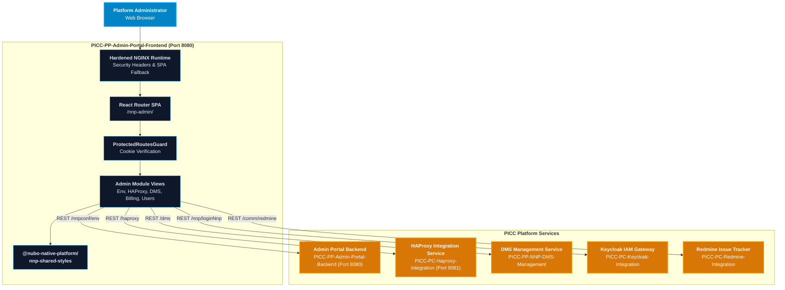

# User Manual and Deployment Guide: `PICC-PP-Admin-Portal-Frontend`

This document provides an end-to-end user manual, configuration guide, and production deployment handbook for **`PICC-PP-Admin-Portal-Frontend`** within the **Nubo Native Platform (NNP)**.

---

## Table of Contents

1. [System Architecture & Portal Role](#1-system-architecture--portal-role)
2. [Prerequisites & System Requirements](#2-prerequisites--system-requirements)
3. [Configuration Reference & Environment Variables](#3-configuration-reference--environment-variables)
4. [Administrative Modules & Functional Capabilities](#4-administrative-modules--functional-capabilities)
   - [Environment Management & Feature Trees](#environment-management--feature-trees)
   - [HAProxy DataPlane Ingress Orchestration](#haproxy-dataplane-ingress-orchestration)
   - [Document Management Service (DMS) Deployments](#document-management-service-dms-deployments)
   - [User Access, Roles & Tenant Permissions](#user-access-roles--tenant-permissions)
   - [Account Billing, Plans & Component Quotas](#account-billing-plans--component-quotas)
   - [Support Ticketing & Issue Tracking](#support-ticketing--issue-tracking)
5. [Local Build & Containerization](#5-local-build--containerization)
   - [Local Development Server](#local-development-server)
   - [Production Asset Compilation](#production-asset-compilation)
   - [Docker Container Build & Execution](#docker-container-build--execution)
   - [Docker Compose Multi-Container Setup](#docker-compose-multi-container-setup)
6. [Production Deployment on Kubernetes](#6-production-deployment-on-kubernetes)
   - [Kubernetes Deployment & Service Manifest](#kubernetes-deployment--service-manifest)
   - [NGINX Reverse Proxy & Ingress Rules](#nginx-reverse-proxy--ingress-rules)
7. [Troubleshooting & Frequently Asked Questions](#7-troubleshooting--frequently-asked-questions)

---

## 1. System Architecture & Portal Role

`PICC-PP-Admin-Portal-Frontend` serves as the centralized governance cockpit for platform administrators across the Nubo Native Platform. It integrates with backend core services to manage platform environments, automate HAProxy traffic routing, deploy document management microservices, control tenant user access, and oversee account resource quotas.



---

## 2. Prerequisites & System Requirements

| Requirement | Minimum | Recommended |
| :--- | :--- | :--- |
| **Node.js** | 20.x LTS | 22.x LTS |
| **npm** | 10.0+ | Latest |
| **RAM** | 2 GB | 4 GB |
| **Modern Browser** | Chrome 100+, Firefox 100+, Edge 100+, Safari 16+ | Latest Chrome or Edge |
| **Docker (Optional)** | 20.10+ | Latest Docker Desktop / Engine |

---

## 3. Configuration Reference & Environment Variables

All configuration is externalized using Vite environment variables prefixed with `VITE_`.

| Variable | Type | Default | Description |
| :--- | :--- | :--- | :--- |
| `PORT` | Integer | `8080` | Port on which the NGINX web server or dev container listens |
| `VITE_BASE_URL` | String | `/nnp-admin/` | Base URL path where the SPA router is mounted |
| `VITE_DOMAIN` | String | `http://localhost:3000` | Base domain for platform services |
| `VITE_AUTH` | String | `http://localhost:3000/nnp` | Keycloak/Auth service login and session API |
| `VITE_AUTH_HOST` | String | `http://localhost:3000/nnp` | Platform authentication gateway host |
| `VITE_DASH` | String | `http://localhost:3000/nnpdash` | User dashboard API endpoint |
| `VITE_DASH_HOST` | String | `http://localhost:3000/nnpdash` | User dashboard host |
| `VITE_ADMIN_POTAL` | String | `http://localhost:3000/nnpconf` | Platform admin configuration service root |
| `VITE_NNP_CONFT` | String | `http://localhost:3000/nnpconf` | Admin configuration private endpoints |
| `VITE_NNP_CONFT_PUB`| String | `http://localhost:3000/nnpconf-pub` | Public lookup endpoints (countries, org types) |
| `VITE_API_ENVIRONMENT_MANAGEMENT_URL` | String | `/nnpconf/env` | Environment topologies & features service |
| `VITE_API_USER_ACCESS_URL` | String | `/nnpconf/user` | User access and role management API |
| `VITE_API_DMS_MANAGEMENT_URL` | String | `/dms-management-service/api/dms` | Document Management Service API |
| `VITE_API_CONFIG_URL` | String | `http://localhost:8081` | HAProxy DataPlane API integration service |
| `VITE_SUPPORT_URL` | String | `/nnpdash/support` | Platform support ticket service URL |
| `VITE_REDMINE_URL` | String | `https://redmine.example.com` | Redmine project management tracker root |
| `VITE_COOKIE_DOMAIN` | String | `.localhost` | Cookie domain scoping for session credentials |
| `PRODUCTION` | Boolean | `false` | Production environment flag |

---

## 4. Administrative Modules & Functional Capabilities

### Environment Management & Feature Trees
- Navigate through hierarchical environment structures: Environments $\rightarrow$ Features $\rightarrow$ Elements $\rightarrow$ Child Elements.
- Track real-time activity logs per environment ID.
- Create, update, and deprecate feature definitions and configurations dynamically.

### HAProxy DataPlane Ingress Orchestration
- Manage live routing configurations powered by `PICC-PC-Haproxy-Integration`.
- Supported backend types:
  - `K8S_DNS`: Cluster DNS resolution for Kubernetes pods.
  - `EXTERNAL_IP`: Direct IP and port targeting for off-cluster services.
  - `SSL`: Upstream SSL/TLS offloading.
  - `PATH_REWRITE`: Prefix stripping and path modification rules.
  - `WEBSOCKET`: Long-lived connection tunnels with extended timeouts.
  - `TIME_CONFIGURABLE`: Custom server/client timeout overrides.
  - `TCP`: Pure L4 TCP stream proxying.
- Perform drift imports from `/etc/haproxy/haproxy.cfg` into the DataPlane API model.

### Document Management Service (DMS) Deployments
- Deploy DMS microservice containers with custom CPU, memory, and disk specifications.
- Verify VM connectivity before deploying via the integrated status checker.
- Launch live web terminal sessions directly to deployed DMS host instances.

### User Access, Roles & Tenant Permissions
- Administer multi-tenant accounts, RBAC roles, and fine-grained feature permissions.
- Manage user lifecycle: activation, password resets, and session revoking.

### Account Billing, Plans & Component Quotas
- Monitor account token consumption, monthly billing lines, and component limits.
- Assign and upgrade service subscription tiers.

### Support Ticketing & Issue Tracking
- Manage platform incident tickets submitted by tenant users.
- Deep-link directly into the platform Redmine issue tracking instance.

---

## 5. Local Build & Containerization

### Local Development Server
```bash
# Copy template and adjust variables
cp .env.example .env

# Install dependencies
npm ci --legacy-peer-deps

# Run Vite dev server
npm run dev
```

### Production Asset Compilation
```bash
# Type check and build static distribution
npm run build
```
The optimized bundle will be generated under `/dist`.

### Docker Container Build & Execution
```bash
# Build production Docker image
docker build -t picc-pp-admin-portal-frontend:latest .

# Run container on port 8080
docker run -d -p 8080:8080 --name admin-portal-frontend picc-pp-admin-portal-frontend:latest
```

### Docker Compose Multi-Container Setup
```bash
# Launch container with healthchecks
docker compose up -d

# Verify container health status
docker compose ps
```

---

## 6. Production Deployment on Kubernetes

### Kubernetes Deployment & Service Manifest

```yaml
apiVersion: apps/v1
kind: Deployment
metadata:
  name: picc-pp-admin-portal-frontend
  namespace: nnp-core-components
  labels:
    app.kubernetes.io/name: admin-portal-frontend
    app.kubernetes.io/part-of: nubo-native-platform
spec:
  replicas: 2
  selector:
    matchLabels:
      app.kubernetes.io/name: admin-portal-frontend
  template:
    metadata:
      labels:
        app.kubernetes.io/name: admin-portal-frontend
    spec:
      containers:
        - name: frontend
          image: ghcr.io/nubo-native-platform/picc-pp-admin-portal-frontend:latest
          imagePullPolicy: IfNotPresent
          ports:
            - containerPort: 8080
              name: http
          resources:
            requests:
              cpu: 50m
              memory: 128Mi
            limits:
              cpu: 250m
              memory: 512Mi
          livenessProbe:
            httpGet:
              path: /healthz
              port: 8080
            initialDelaySeconds: 10
            periodSeconds: 15
          readinessProbe:
            httpGet:
              path: /healthz
              port: 8080
            initialDelaySeconds: 5
            periodSeconds: 10
          securityContext:
            readOnlyRootFilesystem: false
            runAsNonRoot: true
            runAsUser: 101
            allowPrivilegeEscalation: false
---
apiVersion: v1
kind: Service
metadata:
  name: picc-pp-admin-portal-frontend-svc
  namespace: nnp-core-components
spec:
  type: ClusterIP
  ports:
    - port: 8080
      targetPort: 8080
      name: http
  selector:
    app.kubernetes.io/name: admin-portal-frontend
```

### NGINX Reverse Proxy & Ingress Rules
When proxying requests through a platform ingress controller or HAProxy:
```nginx
location /nnp-admin/ {
    proxy_pass http://picc-pp-admin-portal-frontend-svc.nnp-core-components.svc.cluster.local:8080;
    proxy_set_header Host $host;
    proxy_set_header X-Real-IP $remote_addr;
    proxy_set_header X-Forwarded-For $proxy_add_x_forwarded_for;
    proxy_set_header X-Forwarded-Proto $scheme;
}
```

---

## 7. Troubleshooting & Frequently Asked Questions

### Blank Page on Sub-Routes (404 on Refresh)
- **Cause**: The web server is not directing SPA history mode fallback requests to `index.html`.
- **Resolution**: Ensure NGINX has `try_files $uri $uri/ /nnp-admin/index.html;` configured within the `/nnp-admin/` block.

### API Requests Failing with CORS or Network Errors
- **Cause**: Incompatible `VITE_COOKIE_DOMAIN` or backend reverse proxy headers.
- **Resolution**: Ensure `VITE_COOKIE_DOMAIN` matches the root domain (e.g. `.example.com` or `.localhost`). Verify that the backend API gateway allows cross-origin requests or that all calls are routed via reverse proxy paths.

### Session Expiring or Login Modal Reappearing
- **Cause**: Authentication cookie (`nnp-token`) missing or expired.
- **Resolution**: Verify browser cookie settings allow credentials (`SameSite=Lax`). Check Keycloak token lifetime configuration.
